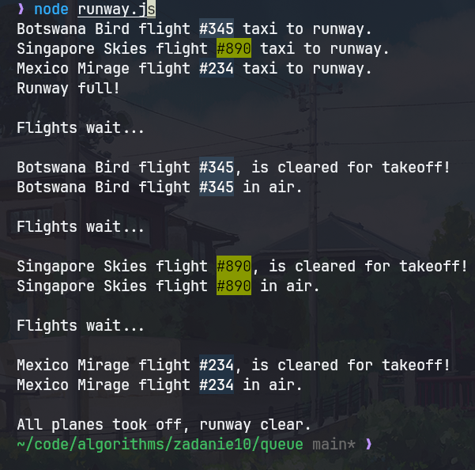

| Algorytmy i złożoność | laboratorium |
|-----------------------|--------------|
| SAN                   |              |
| Autor                 | Yaroslav Zubiakha |
| E-mail                | 121546@student.san.edu.pl / yar.zubaha@proton.me |
| Nr albumu             | 121546       |
| Data                  | 14.06.2024   |
| Wersja                | 1.0          |

 

# **Zadanie nr 10** 

 

> ## Opis zadania
Zaimplementować własny stos lub kolejkę i zademonstrować działanie jego metod: dodawania oraz usuwania elementów.

Na ocenę 5 praca powinna zawierać:
- Metody:
    - Push
    - Pop
    - isEmpty
    - size.
- Własny kod kolejki lub stosu.
- Przebieg obliczeń: demonstracja działania metod.

 

> ## Kod algorytmu
Located in directories: `./queue/` and `./stack/`

 

> ## Przebieg obliczeń

Homework contains two small programs that utilise Queue and Stack that I built while following codecademy courses.

### For Queue:  

In file `./queue/Queue.js` located Queue data structure, that contains following methods:  
- `isEmpty` that returns boolean `true` if `Queue` is empty;  
- `hasRoom` that return boolean `true` if size of `Queue` less than it's maximum size, i.e. there is room push elements;  
- `enqueue` checks if `Queue` has room, and if it does, it adds a new element to the `Queue` utilizing LinkedList's method `addToTail`, and throws an error otherwise;  
- `dequeue` checks if `Queue` is not empty, and if it is, it deletes first element from the `Queue`, utilizing LinkedList's `removeHead` method, and throws an error otherwise;  
- property `size`, shows the size of the `Queue`;  

In file `./queue/runway.js` located program that will help the air traffic control move planes to the runway and allow those planes to take off in a FIFO order.
Here is the sequential overview of program's calculations:
1. Initialize a new `Queue` with a capacity of 3 to represent the runway.
2. Iterate over the array of flights.
3. For each flight:
   - Attempt to enqueue the flight onto the runway.
   - If successful, log the message: "[Flight] taxi to runway."
   - If the runway is full (queue capacity reached), catch the error and log the message: "Runway full!"
4. Return the runway queue filled with the flights that were enqueued.

5. To clear the runway for takeoff:
   - While the runway queue is not empty:
     - Dequeue a flight from the runway.
     - Log the message: "\nFlights wait...\n"
     - Log the message: "[Cleared flight], is cleared for takeoff!\n[Cleared flight] in air."
   - Once the runway queue is empty, log the message: "\nAll planes took off, runway clear."

6. Create an array of flight strings representing the flights ready for departure.
7. Call the `load` function with the array of flights to enqueue them onto the runway.
8. Call the `clear` function with the runway queue to clear each plane for takeoff. 

 

### For Stack:
In file `./stack/Stack.js` located Stack data structure, that contains following methods:
- `isEmpty` that returns boolean `true` if `Stack` is empty;  
- `hasRoom` that return boolean `true` if size of `Stack` less than it's maximum size, i.e. there is room push elements;  
- `push` checks if `Stack` has room, and if it does, it adds a new element to the `Stack` utilizing LinkedList's method `addToHead`, and throws an error otherwise;  
- `pop` checks if `Stack` is not empty, and if it is, it deletes first element from the `Stack`, utilizing LinkedList's `removeHead` method, and throws an error otherwise;  
- `peek` checks if `Stack` is empty, if it is - throws an error, otherwise returns data from the top of the `Stack`;
- property `size`, shows the size of the `Stack`;  

In file `./stack/webNavigaion.js` located program that simulates the navigational operations of a web browser such as:
- opening a new web page
- navigating back a page
- going forward a page. 
`Stack` class is used to maintain the history of visited pages with a backPages stack and a nextPages stack. 

Here is the sequential overview of program's calculations:
1. **Initialization:**
    - Import `Stack` class and `prompt-sync`.
        - `prompt-sync` used to ask user for input in the terminal.
    - Initialize `backPages` and `nextPages` as new instances of `Stack`.
    - Set `currentPage` to `"Home page"`.
    - Set `finish` to `true`, `showBack` and `showNext` to `false`.

2. **Helper Functions Defined:**
    - `showCurrentPage(action)`: Prints the current, previous, and next pages.
    - `newPage(page)`: Pushes the `currentPage` onto `backPages`, sets `currentPage` to `page`, and clears `nextPages`.
    - `backPage()`: Pushes the `currentPage` onto `nextPages`, pops from `backPages` to set as `currentPage`.
    - `nextPage()`: Pushes the `currentPage` onto `backPages`, pops from `nextPages` to set as `currentPage`.

3. **Main Loop:**
    - Call `showCurrentPage("Welcome back")` to display the initial state.
    - Enter a `while(finish)` loop which runs until `finish` is set to `false`.

4. **User Input Loop:**
    - Construct `instructions` string:
      - Always include `baseInfo`.
      - Include `backInfo` if `backPages` is not empty and set `showBack` to `true`.
      - Include `nextInfo` if `nextPages` is not empty and set `showNext` to `true`.
      - Include `quitInfo`.

5. **Prompt User for Input:**
    - Display `instructions` and prompt the user with `question`.

6. **Handle User Input:**
    - Convert `answer` to lowercase (`lowerCaseAnswer`).
    - If `lowerCaseAnswer` is a string longer than one character, call `newPage(answer)`.
    - If `lowerCaseAnswer` is `"n"` and `showNext` is `true`, call `nextPage()`.
    - If `lowerCaseAnswer` is `"b"` and `showBack` is `true`, call `backPage()`.
    - If `lowerCaseAnswer` is `"n"` and `showNext` is `false`, print "There is no next pages".
    - If `lowerCaseAnswer` is `"b"` and `showBack` is `false`, print "There is no previous pages".
    - If `lowerCaseAnswer` is `"q"`, set `finish` to `false` to exit the loop. 

