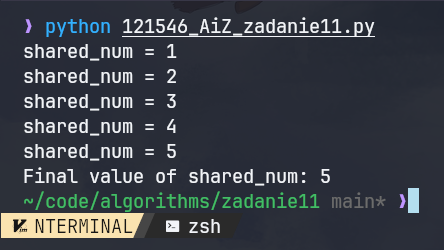

| Algorytmy i złożoność | laboratorium |
|-----------------------|--------------|
| SAN                   |              |
| Autor                 | Yaroslav Zubiakha |
| E-mail                | 121546@student.san.edu.pl / yar.zubaha@proton.me |
| Nr albumu             | 121546       |
| Data                  | 24.06.2024   |
| Wersja                | 1.0          |

 

# **Zadanie nr 11** 

 

> ## Opis zadania
Zaimplementować sposób synchronizacji pracy 2 wątków, modyfikujących wspólny zasób (np. zmienną int, float lub string).

- Przynajmniej 2 wątki modyfikujące jeden zasób.
- Synchronizację działania za pomocą wybranej metody:
    - mutex
    - semafor
    - operacji atomowej
    - lub innej metody synchronizacji
- Przebieg obliczeń: demonstracja działania metod.

 

> ## Kod algorytmu
Znajduje się w pliku `./121546_AiZ_zadanie11.js`

 

> ## Przebieg obliczeń

### Program Description

This program demonstrates thread synchronization using a mutex to ensure safe modification of a shared integer variable (`shared_num`) by multiple threads.

### Criteria

1. **At least 2 threads modifying a shared resource:**
    - The program creates and starts multiple threads that modify the shared variable `shared_num`.

2. **Synchronization using a selected method:**
    - **Mutex**: The program uses a `Lock` object (mutex) to synchronize access to the shared variable, ensuring only one thread can modify it at a time.

3. **Demonstration of method's functionality:**
    - The program shows how the threads acquire and release the mutex while modifying the shared variable, demonstrating safe concurrent access.

### Course of Calculations

#### Initial Setup

1. Define the shared variable `shared_num` and initialize it to `1`.
2. Create a `Lock` object (`mutex`) for synchronization.

#### Thread Function

1. Define the function `process_data(new_value: int)`:
    - Declare `shared_num` as a global variable.
    - Acquire the mutex to ensure exclusive access to `shared_num`.
    - Update `shared_num` with the new value `new_value`.
    - Print the updated value of `shared_num`.
    - Release the mutex.

#### Main Execution

1. **First Set of Threads:**
    1. Create two threads (`thread1` and `thread2`), passing different arguments to `process_data`:
        - `thread1` with argument `1`
        - `thread2` with argument `2`
    2. Start both threads.
    3. Wait for both threads to complete using `join`.

2. **Test Function:**
    1. Define the function `test_threads` to demonstrate concurrent execution:
        - Reset `shared_num` to `0`.
        - Create three more threads (`thread3`, `thread4`, `thread5`), passing different arguments to `process_data`:
            - `thread3` with argument `3`
            - `thread4` with argument `4`
            - `thread5` with argument `5`
        - Start all three threads.
        - Wait for all threads to complete using `join`.
        - Print the final value of `shared_num`.

3. Run the `test_threads` function to demonstrate the effect of concurrent execution and synchronization.

#### Demonstration of Methods

1. **Mutex Usage:**
    - The mutex ensures that only one thread can update `shared_num` at a time, preventing race conditions.
    - The `print` statements within `process_data` show the value of `shared_num` being updated safely by each thread.

2. **Output:**
    - The output from the `print` statements and the final value of `shared_num` demonstrate that the threads successfully synchronized their access to the shared variable using the mutex.
---

