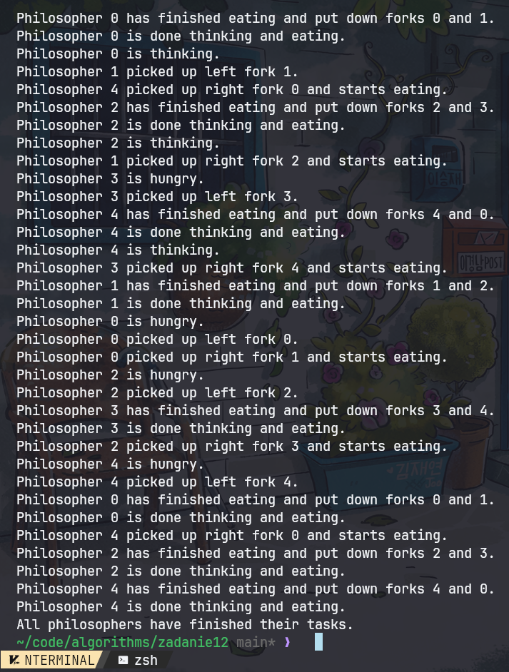

| Algorytmy i złożoność | laboratorium |
|-----------------------|--------------|
| SAN                   |              |
| Autor                 | Yaroslav Zubiakha |
| E-mail                | 121546@student.san.edu.pl / yar.zubaha@proton.me |
| Nr albumu             | 121546       |
| Data                  | 25.06.2024   |
| Wersja                | 1.0          |

 

# **Zadanie nr 12** 

 

> ## Opis zadania
Zaimplementować rozwiązanie zagadnienia ucztujących filozofów.

- Co najmniej:
    - 5 wątków
    - 2 krotne wykonanie zadania przez każdy wątek
- Dokładnie tyle samo zasobów (widelców) ile jest wątków.
- Przebieg obliczeń: demonstracja działania (np. komunikat wątku – wykonuję zadanie).

 

> ## Kod algorytmu
Znajduje się w pliku `./121546_AiZ_zadanie12.py`

 

> ## Przebieg obliczeń

### Course of Calculations for Dining Philosophers Program

1. **Initialization**
    1.1. Define the number of philosophers (`num_philosophers`) as 5.
    1.2. Create a list of forks, each represented by a `threading.Lock`.

2. **Philosopher Function**
    2.1. Each philosopher executes the following steps twice:
        - Print that the philosopher is thinking.
        - Sleep for a random time between 1 and 3 seconds to simulate thinking.
        - Print that the philosopher is hungry.
        - Attempt to pick up the left fork (acquire the lock for the left fork).
        - Print that the philosopher picked up the left fork.
        - Attempt to pick up the right fork (acquire the lock for the right fork).
        - Print that the philosopher picked up the right fork and starts eating.
        - Sleep for a random time between 1 and 2 seconds to simulate eating.
        - Print that the philosopher has finished eating and put down both forks.
        - Print that the philosopher is done thinking and eating.

3. **Thread Creation and Execution**
    3.1. Create a list to hold the philosopher threads.
    3.2. For each philosopher (from 0 to 4):
        - Create a thread targeting the `philosopher` function with the philosopher's ID as an argument.
        - Append the thread to the list of threads.
        - Start the thread.
    3.3. Wait for all philosopher threads to complete using `join`.

4. **Completion**
    4.1. Print that all philosophers have finished their tasks.

### Program Criteria

1. **At least 5 threads:**
    - The program creates 5 threads, one for each philosopher.

2. **Each thread performs the task twice:**
    - Inside the `philosopher` function, each philosopher executes the thinking-eating cycle twice.

3. **Exactly as many resources (forks) as there are threads:**
    - There are 5 forks, each represented by a `threading.Lock`, which is equal to the number of philosophers.

4. **Demonstration of the computational process:**
    - The program includes print statements that demonstrate each philosopher's state (thinking, hungry, picking up forks, eating, done).
---

