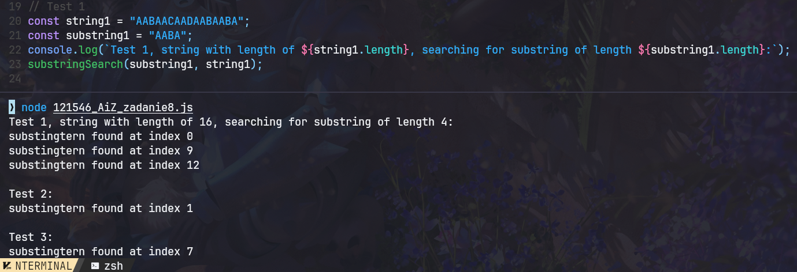

| Algorytmy i złożoność | laboratorium |
|-----------------------|--------------|
| SAN                   |              |
| Autor                 | Yaroslav Zubiakha |
| E-mail                | 121546@student.san.edu.pl / yar.zubaha@proton.me |
| Nr albumu             | 121546       |
| Data                  | 13.06.2024   |
| Wersja                | 1.0          |

 

# **Zadanie nr 8** 

 

> ## Opis zadania
Znaleźć wzorzec w tekście.  

Na ocenę 5 praca powinna zawierać:
- Tekst o długości min 10 znaków.
- Wzorzec o długości min 3 znaki.
- Algorytm.
- Przebieg obliczeń.

 

> ## Kod algorytmu
Znajduje się w pliku `./121546_AiZ_zadanie8.js`

 

> ## Przebieg obliczeń

1. **Define the function `substringSearch`** that takes two parameters: `substring` and `string`.
2. **Inside the function:**
   1. Determine the length of `substring` and `string`, and store them in `subStrLength` and `stringLength` respectively.
   2. Iterate over the `string` from the 0th index to the `(stringLength - subStrLength)`th index. For each index `i`:
      1. Initialize a counter `j` to 0.
      2. While `j` is less than `subStrLength` and the `j`th character of `substring` is the same as the `j`th character from the `i`th index of `string`, increment `j`.
      3. If `j` equals `subStrLength`, it means the `substring` is found at the `i`th index of `string`. Log the index `i`.
3. **Test the function with different inputs**

