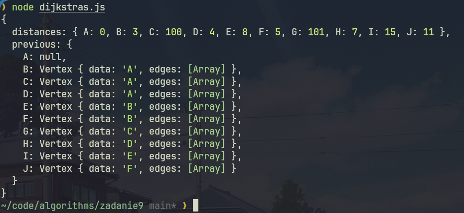

| Algorytmy i złożoność | laboratorium |
|-----------------------|--------------|
| SAN                   |              |
| Autor                 | Yaroslav Zubiakha |
| E-mail                | 121546@student.san.edu.pl / yar.zubaha@proton.me |
| Nr albumu             | 121546       |
| Data                  | 16.06.2024   |
| Wersja                | 1.0          |

 

# **Zadanie nr 9** 

 

> ## Opis zadania
Zaimplementować algorytm Dijkstry działający na strukturze danych kopca. Znaleźć najkrótszą ścieżkę dla przykładowego grafu.  

Na ocenę 5 praca powinna zawierać:
- Drzewo z przynajmniej 10 węzłami.
- Kod programu.
- Dane wejściowe w postaci kopca.

 

> ## Kod algorytmu
Znajduje się w pliku `./dijkstras.js`

 

> ## Przebieg obliczeń
### 1. Graph.js

#### Purpose:
- Defines the `Graph` class, `Vertex` class, and `Edge` class.
- Manages vertices and edges of the graph.
- Provides methods to add/remove vertices and edges.
- Supports both directed and undirected graphs.
- Handles weighted and unweighted edges.

#### Detailed Functionality:
1. **Graph Class:**
   - Manages vertices and edges of the graph.
   - Supports adding/removing vertices (`addVertex`, `removeVertex`).
   - Supports adding/removing edges (`addEdge`, `removeEdge`).
   - Handles both directed and undirected graphs based on constructor parameters.
   - Supports weighted edges based on constructor parameters.

2. **Vertex Class:**
   - Represents a vertex in the graph with associated data (`data`) and edges.
   - Supports adding edges to other vertices (`addEdge`).
   - Supports removing edges from other vertices (`removeEdge`).

3. **Edge Class:**
   - Represents an edge between two vertices.
   - Contains references to the start vertex (`start`), end vertex (`end`), and optionally a weight (`weight`).

### 2. PriorityQueue.js  

#### Purpose:
- Provides a priority queue implementation, using a min-heap.

#### Detailed Functionality:
1. **PriorityQueue Class:**
   - Implements a priority queue using a min-heap structure.
   - Supports operations like adding elements (`add`), removing the minimum element (`popMin`), and checking if empty (`isEmpty`).
   - Ensures efficient priority queue operations for Dijkstra's algorithm.

### 3. dijkstras.js

#### Purpose:
- Implements Dijkstra's algorithm to find the shortest paths from a starting vertex to all other vertices in the graph.

#### Detailed Functionality:
1. **dijkstras Function:**
   - Accepts a graph and a starting vertex as input.
   - Initializes data structures (`distances`, `previous`) for storing shortest path information.
   - Uses a priority queue (implemented in `PriorityQueue.js`) to manage vertices based on their tentative distances.
   - Iteratively explores vertices and updates shortest path information until all vertices are processed.
   - Returns an object containing distances and predecessors for each vertex.

### 4. testGraph.js

#### Purpose:
- Provides a test graph structure for verifying Dijkstra's algorithm.
- Initializes a graph with vertices and edges.

#### Detailed Functionality:
1. **testGraph Initialization:**
   - Creates an instance of the `Graph` class.
   - Adds multiple vertices (at least 10) and connects them with edges.
   - Ensures the graph is connected and has sufficient complexity for testing Dijkstra's algorithm.

---

